<div align="center">
  
  <h1>Forge</h1>
  <p><strong>Your AI coding partner. In the browser. No setup needed.</strong></p>

  <a href="https://forge-for-ideas.vercel.app">
    
  </a>
  &nbsp;
  
  
  
  
  

<br /><br />

  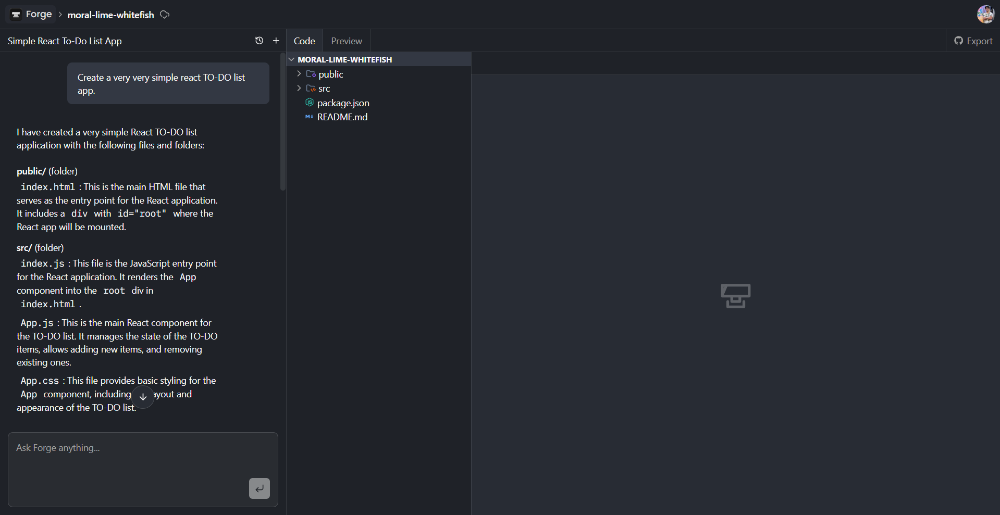
</div>

---

## What is Forge?

Imagine having a **senior developer sitting right next to you** — one who never gets tired, never judges your questions, and can write entire apps in seconds.

That's Forge.

You open the browser, describe what you want to build, and Forge's AI **reads your files, writes code, and updates your project** — all while you watch it happen in real time. No installations. No confusing terminals. Just you and your ideas.

When you're done, Forge runs your app **live inside the browser** — you can see it working immediately. And with one click, you can push it straight to GitHub.

---

## A Quick Tour

### 1. Sign in & land on your dashboard

A beautiful split-screen landing page — showcase on the left, sign-in on the right. Works great on mobile too.

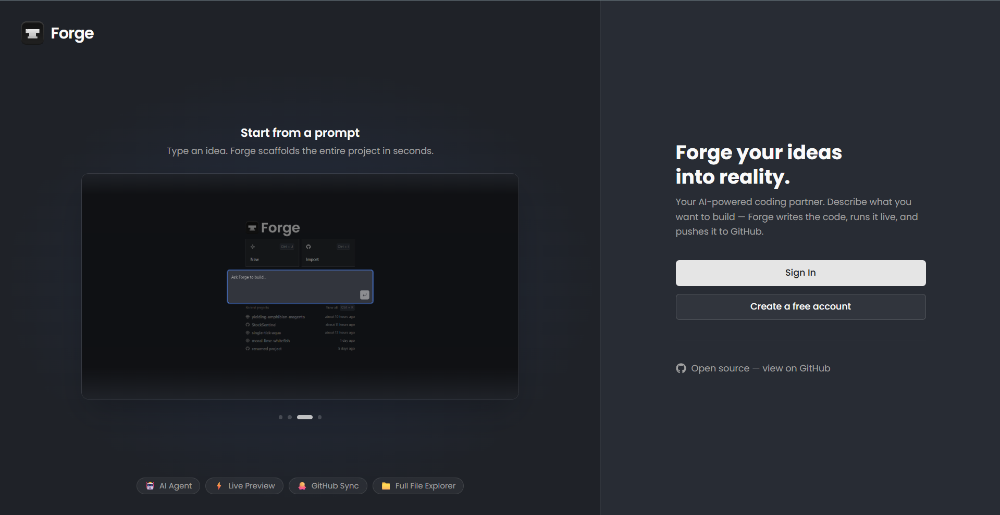

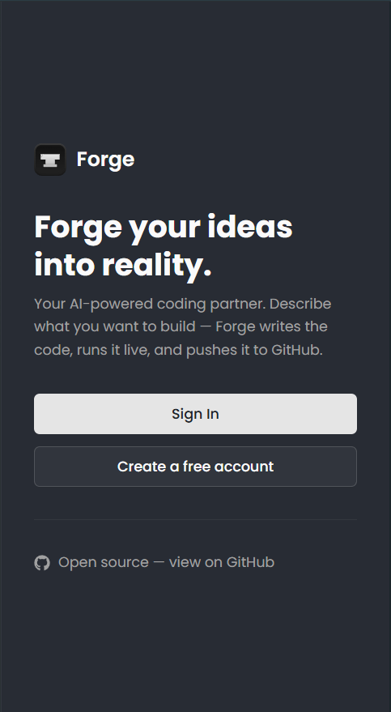

---

### 2. Start a new project — or import one from GitHub

Type what you want to build, or paste a GitHub link to bring in an existing project.

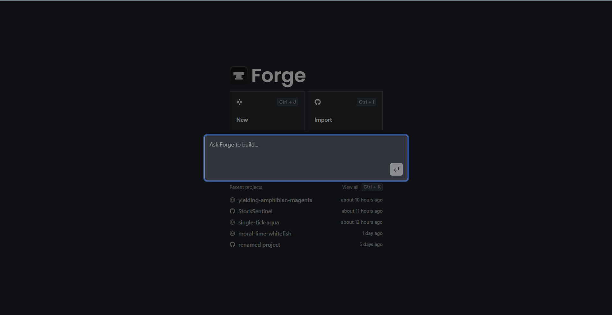 &nbsp; 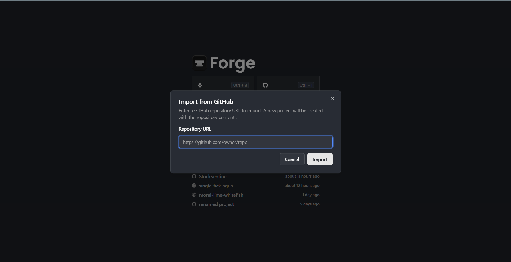

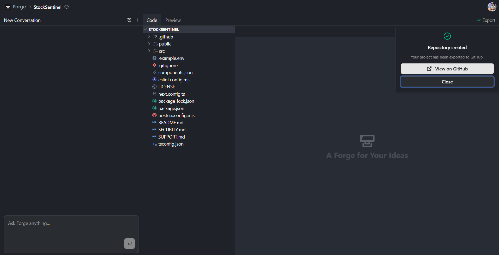

---

### 3. Write code — or just ask Forge to write it for you

A full code editor on the left. A chat sidebar on the right. Ask Forge anything — it reads your files, makes the changes, and explains what it did.


---

### 4. See your app running — live, in the browser

Switch to Preview mode. Forge installs dependencies and boots your app inside the browser. No terminal. No local server.

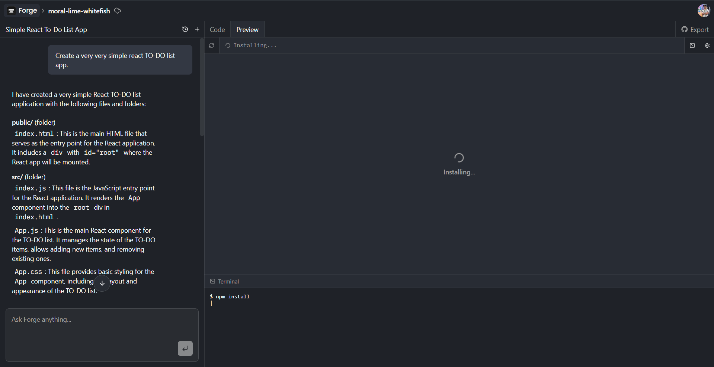

---

### 5. Never lose a conversation

Every AI chat is saved per project. Browse and pick up any past conversation right where you left off.

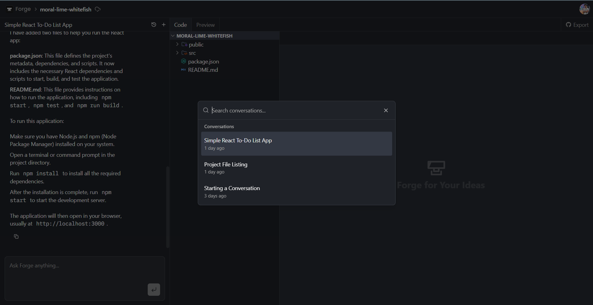

---

### 6. Power features at your fingertips

Quickly jump between all your projects with a command palette (`Ctrl + K`), export your work to a GitHub repo, or manage your plan — all without leaving the app.

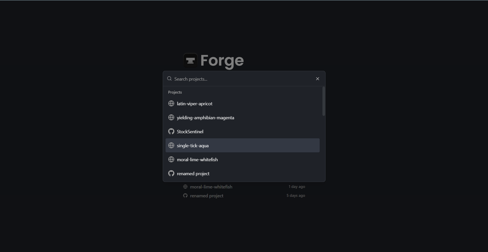 &nbsp; 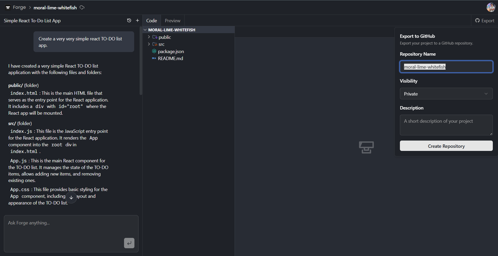


---

## How It All Works

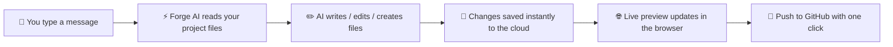

> Forge runs the AI inside a background job (**Inngest**), so it never blocks the UI. Your editor stays fast while the AI does the heavy lifting.

---

## ✨ Features

|     | Feature                                                                              |
| --- | ------------------------------------------------------------------------------------ |
| 🤖  | **AI coding assistant** — Gemini 2.5 Flash reads, writes, creates, and deletes files |
| 🌐  | **Live in-browser preview** — your app runs inside the browser via WebContainers     |
| 📁  | **Full file explorer** — create, rename, delete, and organize files and folders      |
| 💬  | **Persistent AI conversations** — every chat is saved and searchable                 |
| 🐙  | **GitHub import & export** — clone any repo in, push any project out                 |
| ⚡  | **Real-time sync** — every change reflects instantly across tabs                     |
| 🔐  | **Authentication & billing** — secure sign-in and plan management via Clerk          |
| 📱  | **PWA ready** — installable as an app on desktop and mobile                          |

---

## 🛠️ Tech Stack

| What it does                  | Tool                                                                       |
| ----------------------------- | -------------------------------------------------------------------------- |
| Web framework                 | [Next.js 16](https://nextjs.org)                                           |
| AI model                      | [Google Gemini 2.5 Flash](https://deepmind.google/technologies/gemini/)    |
| AI agent runner               | [Inngest](https://inngest.com) + [Agent Kit](https://agentkit.inngest.com) |
| Real-time database            | [Convex](https://convex.dev)                                               |
| In-browser runtime            | [WebContainers](https://webcontainers.io)                                  |
| Authentication                | [Clerk](https://clerk.com)                                                 |
| Code editor                   | [CodeMirror 6](https://codemirror.net)                                     |
| Web scraping (for AI context) | [Firecrawl](https://firecrawl.dev)                                         |
| Error monitoring              | [Sentry](https://sentry.io)                                                |

---

## 🚀 Run It Yourself

### Prerequisites

- [Node.js](https://nodejs.org) 18+
- Accounts on: [Convex](https://convex.dev), [Clerk](https://clerk.com), [Inngest](https://inngest.com), [Google AI Studio](https://aistudio.google.com)

### Steps

```bash
# 1. Clone the repo
git clone https://github.com/Poojan38380/Forge.git
cd forge

# 2. Install dependencies
npm install

# 3. Set up environment variables
cp env.example .env.local
# Fill in all the values — links to each service are in env.example

# 4. Start the app
npm run dev
```

### Environment Variables

```env
# Convex
NEXT_PUBLIC_CONVEX_URL=
CONVEX_DEPLOYMENT=
POLARIS_CONVEX_INTERNAL_KEY=

# Clerk
NEXT_PUBLIC_CLERK_PUBLISHABLE_KEY=
CLERK_SECRET_KEY=

# Google Gemini
GOOGLE_GENERATIVE_AI_API_KEY=

# Inngest
INNGEST_EVENT_KEY=
INNGEST_SIGNING_KEY=

# Firecrawl (optional — for AI web scraping)
FIRECRAWL_API_KEY=
```

---

## 📄 License

MIT — use it, learn from it, build on it.

---

<div align="center">
  <sub>Built by <a href="https://github.com/Poojan38380">Poojan Goyani</a></sub>
</div>
